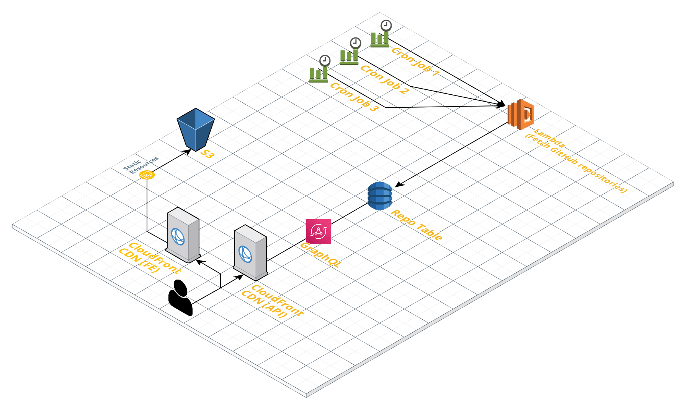

# RepoRadar

[](https://github.com/yetanother-blog/reporadar/actions)

- [Prod](https://reporadar.yetanother.blog)
- [Staging](https://reporadar-staging.yetanother.blog)

## About

The RepoRadar is an internal tool for us to automate the process of finding interesting GitHub repositories. The service crawls GitHub on a regular basis and stores matching repositories in a DynamoDB table. We then use the results to show them on a simple CRA-based web application.



## Dependencies

- [AWS SAM CLI](https://docs.aws.amazon.com/serverless-application-model/latest/developerguide/serverless-sam-reference.html#serverless-sam-cli)
- AWS CLI
- NodeJS
- Yarn
- Docker

## Development

### Install

```sh
$ make dependencies
```

### Frontend

The frontend uses the GraphQL Staging API configured in the `frontend/.env` file. By changing the `REACT_APP_GRAPHQL_API_ENDPOINT` variable, you can also run the frontend against prod or your own environment. 

```sh
$ make start-fe
```

### API

The idea here is, to create your own instance of the API and work with the deployed version directly in AWS.

1. Make sure you have AWS credentials in your environment with permissions to deploy a CloudFormation stack
2. Create a `.env` file (see `.env-template`)
3. Create a S3 bucket for the CloudFormation stack: `make create-bucket`
4. Deploy your stack: `make deploy`

After the deployment, you should see the output of the CloudFormation stack, for instance:

```
-------------------------------------------------------------------------------------------------------------------------------------------------------------------------------
Outputs
-------------------------------------------------------------------------------------------------------------------------------------------------------------------------------
Key                 FrontendDistributionId
Description         CloudFront ID for frontend CDN
Value               E1J6DKDNFKFJRX

Key                 GraphQLApiUrl
Description         Endpoint of the public GraphQL API
Value               https://whatever.cloudfront.net/graphql

Key                 RepoTableName
Description         Name of the DynamoDB database
Value               reporadar-test-RepoTable-whatever

Key                 FrontendBucket
Description         Name of the s3 frontend bucket
Value               reporadar-test

Key                 FrontendUrl
Description         Url for the frontend
Value               https://whatever.cloudfront.net
-------------------------------------------------------------------------------------------------------------------------------------------------------------------------------
```

Use one of the endpoints to test your changes.
